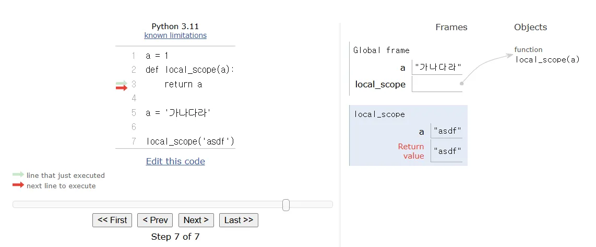

# 2월 3주차 TIL 내용 정리

## 17~21 Feb 2025
> 의 수업 내용 정리를 다룹니다. 
> 날짜별 정리 내용이 아닌, 관련 교육 내용 <python>은 https://github.com/iam-Aerin/python/tree/master [github]의 repository 를 통해 확인 가능합니다. 

>이 내용은 날짜별 (혹은 주차별) TIL 기록을 위해 생성했습니다. 

### Links (이번주 학습에 사용된 링크모음)
- [requests모듈링크] https://requests.readthedocs.io/en/latest/
- [동행복권 이번주 로또 당첨번호]https://dhlottery.co.kr/gameResult.do?method=byWin&wiselog=C_A_1_2
- [파이썬 자습서] https://docs.python.org/ko/3.13/tutorial/index.html
- [영화산업진흥위원회 오픈 API] https://www.kobis.or.kr/kobisopenapi/homepg/main/main.do

### keyword
> dictionary, set, module, package, datetime, 로또, 버블함수, 객체지향 (OOP), 클래스

> 한 일: `python` (jupyter notebook을 통해 수업 내용 정리), `programmers`에서 관련 예제 풀이 (`algo`: https://github.com/iam-Aerin/algo)를 통해 문제 풀이 세부 내용이 확인가능합니다. 

> 자주 틀리는 내용!
##### String 은 immutable 하므로 수정이 불가하다.

> 어려웠던 예제!
+ https://www.kobis.or.kr/kobisopenapi/homepg/main/main.do
  (영화산업진흥위원회 오픈 API)

```python
#<모음제거하기>

words = 'my name is hong'

#vowels = 'aeiou' # => String 타입으로 선언. 
# 모음집합을 만들어서 알려줌.  
result = []
#내가 찾아 넣을 [] 빈공간을 생성해준다.  

for char in words: 
    #if char 모음목록에 있다면
    if char not in 'aeiou': 
        result.append(char)
        #제거해야한다. 
        #문자열을 제거하는 건 불가능 (immutable 하기에)
    #자음인 경우
    # else:
    #     result.append(char)
print(result)
print(''.join(result))
```

```python
#[리스트] 안의 데이터 숫자세기

blood_type = ['A', 'B', 'A', 'B', 'O', 'AB', 'A', 'A', 'AB']

result = {
    'A': 0,
    'B': 0,
    'AB': 0,
    'O': 0, 
}

for blood in blood_type:
    #result['A']
    result[blood] += 1

print(result)
#=> {'A': 4, 'B': 2, 'AB': 2, 'O': 1}
```

```python
<자릿수더하기/sol3.py>

def solution(n):
    answer = 0

    for i in str(n):
        answer = answer + int(i)
#두번의 형변환을 시킴. 

    return answer

print(solution(1234))
```

```
이외에도, `05_module.ipynb`의 '로또번호 - 등수` 예측하기 (random, requests: module을 통해 api 불러오기, for문 적용을 공부할 수 있는 예시) 등 다양한 예제문제를 해결함.
```

#
#
#

# 기본함수 내용정리 목차
## 04_data_structure.ipynb 에서도 확인이 가능합니다.
#### https://github.com/iam-Aerin/python/blob/master/04_data_structure.ipynb?short_path=4e7ead0 

1. 메소드
    1. 문자열 메소드
    2. 리스트 메소드
    3. 딕셔너리 메소드
    4. 세트 메소드
2. 기타 함수
    1. map
    2. fliter
    3. zip
3. 모듈
4. 패키지
5. datetime
6. 외부라이브러리
    1. requests
7. 객체지향프로그래밍
    1. 클래스, 속성, 행동, 인스턴스
    2. 생성자와 소멸자
    3. 상속
#
#
#

# 1. 메소드(method)
- 메소드 : 객체 안에 들어있는 함수

## 1-1. 문자열 메소드(string method)
- 문자열은 `immutable`하므로 수정 불가
- 원문 수정하고 싶다면 재할당 

- `.capitalize()`
    - 맨 앞 글자를 대문자로 변환

- `.title()`
    - 각 음절 첫글자만 대문자로 변환

- `.upper()`
    - 대문자로 변환

- `.lower()`
    - 소문자로 변환

- `.strip([chars])`
    - [ ] 기입시 내부 문자를 지우고, 미기입시 공백(문자열 좌우 공백)을 지움
    - `.lstrip()`
    - `.rstrip()`
- `.replace(old, new[, count])`
    - old를 찾아서 new로 변환(count만큼)
- `.find(x)`
    - 찾는 문자의 위치를 반환
    - 여러 곳에 위치한 경우 첫 위치 반환
    - 없으면 -1 반환
    - 공백 포함
- `.index(x)`
    - .find와 유사하지만 찾는 문자 없을 경우 오류발생
    - 공백 포함
- `.split(x)`
    - x를 기준으로 분할, x입력 안하면 공백을 기준으로 분할
- `.count(x)`
    - 문자열 내부의 x 갯수 반환


## 1-2. 리스트 메소드
```
##### append: 뒤에 데이터를 붙일때, pop: 맨 뒤의 데이터를 뺄 때, 이 둘을 가장 많이 쓰게 될 것임.
```

- `.append(x)`
    - list에 x 추가
- `.extend(iterable)`
    - list끼리 결합
- `.insert(idx, x)`
    - 특정위치에 데이터 삽입
- `.remove(x)`
    - x위치의 데이터 제거
- `.pop([idx])`
    - 리스트의 마지막 요소 또는 인덱스에 해당하는 데이터를 빼냄
- `.sort()`
    - 리스트 내부 데이터를 크기순 정렬
    - 원본수정, return 없음
    - `.sort(reverse=True)` : 역순
    - `sorted()` : 함수, 메소드X, 원본수정X, 정렬된 데이터 return
- `.reverse()`
    - 리스트 정렬 순서를 뒤집음, 원본수정
    - list slicing 이용해서 비슷한 결과 낼 수 있음


### list copy
- origin list = [1, 2, 3]
- copy_list = origin_list
- 이때, copy 리스트의 데이터를 수정하면 origin_list도 함께 수정됨 (원본 데이터가 덮어씌어짐.)

```python
origin_list = [1, 2, 3]
copy_list = origin_list[:] # => 슬라이싱 해주세요. 처음부터 끝까지 

copy_list[0] = 100

print(origin_list)
print(copy_list)
```

### list comprehension


```python
# 예제 for list comprehension
#짝수만 고르기 

numbers = list(range(1, 31)) # => 1부터 30까지의 데이터 
print(numbers)

result = []
for number in numbers:
    if number % 2 == 0:
        # 짝수인 값을 reult에 쌓을 것이다. 
        result.append(number)
print(result)
```

## 1-3. dictionary 메소드
- `.pop(key[, default])`
    - 해당하는 key의 value pop
    - 원본 수정
- `.update(key=value)`
    - 딕셔너리 내부 데이터 수정
- `.get(key[, default])`
    - 해당하는 key와 value를 가져옴
    - 원본수정 X
    - 해당하는 값 없으면 none 반환

### dict comprehension
```python
# {1: 1, 2: 8, 3: 27, ... 10: 1000}

result = {}
numbers = range(1, 11)

for number in numbers:
    result[number] = number ** 3
    # result[key] = value

print(result)

{1: 1, 2: 8, 3: 27, 4: 64, 5: 125, 6: 216, 7: 343, 8: 512, 9: 729, 10: 1000}
```

> 딕셔너리(dictionary)는 키(key)와 값(value)을 쌍으로 저장하는 자료형입니다.

> result = {} result는 빈 딕셔너리로 시작 → {} 🔹 2. for number in numbers: numbers = range(1, 11)이므로, number는 1부터 10까지 하나씩 반복됨. 🔹 3. result[number] = number ** 3 number를 딕셔너리의 키(key)로 사용하고, number ** 3을 딕셔너리의 값(value)으로 저장.

```python
result = {number: number ** 3 for number in range(1, 11)}
#dictionary 이므로 key와 value 를 함께 써줘야한다. 
print(result)

{1: 1, 2: 8, 3: 27, 4: 64, 5: 125, 6: 216, 7: 343, 8: 512, 9: 729, 10: 1000}
```


## 1-4. Set 메소드
- `.add()`
    - 데이터 추가후 정렬되지 않은 데이터가 나옴(인덱스 접근 불가)
    - 하나의 데이터 중복 불가
- `.update()`
    - 괄호 안에 하나의 값만 넣을 경우, 시퀀스 형태 데이터를 하나 하나 잘라서 요소 업데이트
    - 여러 개의 값 업데이트
- `.pop`
    - 무작위의 요소를 pop

```python
fruits = {'apple', 'banana', 'melon'}

fruits.add('watermelon')
-> {'watermelon', 'melon', 'apple', 'banana'}

fruits.update('grape')
-> {'p', 'e', 'banana', 'watermelon', 'apple', 'melon', 'g', 'a', 'r'}

fruits.update({'orange', 'grape'})
-> {'p', 'e', 'banana', 'watermelon', 'apple', 'orange', 'melon', 'g', 'a', 'r', 'grape'}

fruits.remove('apple')
-> {'banana', 'melon', 'watermelon', 'orange', 'grape'}

fruits.pop()
-> {'melon', 'watermelon', 'orange', 'grape'}
#랜덤하게 지움. 
```
# 2. Map, filter, zips
## 2-1. map(function, itrerable)
- `function`을 `iterable`에 적용한다.
- iterable: 반복가능한 객체 => sequence 타입

```python
numbers = [1, 2, 3, 4, 5]
# => ['1', '2', '3', '4', '5']
result = []
for number in numbers: 
    result.append(str(number))
print(result)

#숫자리스트를 str리스트로 바꾸는 단순 for문
->
['1', '2', '3', '4', '5']

map(str, numbers)
print(result)
#내가 데이터 각각에 실행하고 싶은 함수를 알려줌. => str
print(list(result))
# => 최종적으로 list로 바꿔주고 출력을 시켜야함
->
['1', '2', '3', '4', '5']
['1', '2', '3', '4', '5']


```

## 2-2. filter(function, iterable)
- filter에 들어가는 function은 T/F를 반환해야함
- 조건에 부합하는 애들만 거르는 과정

```python
def is_odd(x):
    return x % 2
    #결과가 항상 True or False 일때 적용한다. => filter
    #함수를 선언해준다.

filter(is_odd, numbers)
print(result)
print(list(result))

#filter(True or False의 답을 내는 함수이름, 데이터값) 
-> [1, 3, 5]
-> [1, 3, 5]
```
- 이 때 is_odd(함수)의 결과가 `True`인 것만 반환

## 2-3. zip
- 쌍으로 묶어줌
- 대치되는 갯수만큼만 결과 생성
```python
a = [1, 2, 3]
b = [100, 200, 300]

result = zip(a, b)
print(result)
print(list(result))

#두개의 데이터셋 리스트를 묶을때 사용함. 
<zip object at 0x00000143A1C6E500>
[(1, 100), (2, 200), (3, 300)]
```
# 7. 객체지향프로그래밍 (OOP)
#예를 들어, 우리가 핸드폰을 만든다고한다면? 
#그 안의 기능들은? 어떻게 만들 것인가.

```
만일 내가 다른 번호의 핸드폰으로 위와 같은 핸드폰 기능을 만드려고하면,
너무 귀찮아진다. 안에 들어있는 번호를 일일히 다 바꾼다는 것은 불가능
따라서, '핸드폰'이라는 기능을 가지는 'class'를 만들어 무한생성이 가능하도록
```

```python
number = '010-2222-2222'
power = True
phone_book = {
    'kim': '010-1234-1234',
    'park': '010-9876'9876',
}
#dictionary 형태로 전화번호부를 생성함. 
def call(from_num, to_num):
    print(f'{from_num}가 {to_num}한테 전화 거는중')

call(number, phone_book['kim'])
```

## 7-1 class
클래스 선언 정의
```python
class ClassName():
#camel표기법(각단어의 시작을 대문자로 표기)
    attribute1 = value1
    attribute2 = value2
    #값, 속성, 정보를 넣는 공간을 생성한다 (변수를 정의한다와 동일)
```

인스턴스화 (클래스 실행)

c = CLassName()

또다른 예시

```python
class Person():
    name = ''
    gender = ''
    age = 0
    height = 0

    def greeting(self):
        print(f'안녕하세요. 나는 {self.name} 이애요~(•ө•)♡.')
    
    def grow(self):
        self.age += 1
        #나이를 한살 먹는다를 표현중
#사람 (Person) 에 대한 클래스를 정의함. 
#2개의 기능을 부여했슴.
```


### 클래스 변수/ 인스턴스 변수
```python
클래스 변수 : 클래스 선언 블록 최상단에 위치
인스턴스 변수 : 인스턴스 내부에서 생성한 변수
class MyClass():
    class_variable = '클래스변수'

    def __init__(self):
    self.instance_variable = '인스턴스 변수'
```

## 7-2 생성자와 소멸자
```python
class Person:
    def __init__(self, n):  # 생성자 추가
        self.name = n
        print('생성됨')

    def __del__(self):
        print('소멸됨')
```

## 7-3 상속

#한번 만들어 놓은 것을 어디서든 가져와서 쓰기위해서
```python
class Person():
    def __init__(self, name, age, email, phone):
        self.name = name
        self.age = age
        self.email = email
        self.phone = phone
        
        
class Student(Person):

    def __init__(self, name, age, email, phone, studnet_id):
    #     self.name = name
    #     self.age = age
    #     self.email = email
    #     self.phone = phone
    #부모 (Person)의 특성을 상속받음.
    #     self.student_id = student_id

#    => 부모가 가진 __init__이라는 함수를 먼저 호출해올것이다. 

# => 너무 긴 코드 해결하고자
# => 아래처럼 super(). 불러오고자하는 부모의 함수를 실행한다. 
```


## 이미지로 다시보는 이번주 공부
### 이름공간 (namespace), 스코프 (scope)

python 에서 사용하는 이름들은 이름공간에 저장되어있습니다. `LEGB 룰`에 따라 접근

1. Local : 정의된 함수 내부
2. Enclosed : 상위 함수
3. Global : 함수 밖
4. Built-in : python 이 기본적으로 가지고 있는 함수



### 파이썬의 데이터 저장 구조
⇒ 파이썬은 기본적으로 Stack 구조를 띄나, Queue 처럼 (맨 앞 데이터를 불러옴) 쓸 수 있음.


### 버블정렬 (bubble sort with Hungarian, folk dance)

- 가장 큰 숫자가 오른쪽으로 밀려남.⇒ 오른쪽에 가장 큰 숫자가 고정됨
- 다시 처음부터 큰 숫자를 찾아 자리를 바꿔, 오른쪽으로 고정 시킴.


