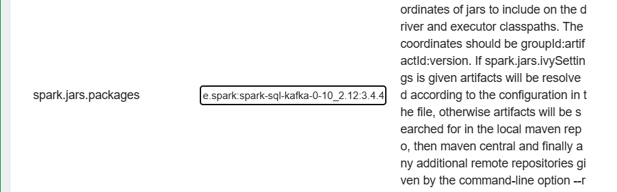

*4월 4주차*

```Data engineering/ ml```
> `MLlib.md`, `recommendation.md`, `kafka.md`

_#내맘대로TIL챌린지 #동아일보 #미디어프론티어 #글로벌소프트웨어캠퍼스 #GSC신촌_

_글로벌소프트웨어캠퍼스와 동아일보가 함께 진행하는 챌린지입니다._


---


# Regression
> zeppelin에서 ml 모듈을 사용하여 regression을 수행할 수 있다.

- `fish.csv` 파일을 이용해서 선형 회귀 (regression) 모델을 생성하고 예측한다.

```spark-shell
file_path = 'hdfs://localhost:9000/input/fish.csv'
# file_path = 'file:///home/ubuntu/damf2/data/fish.csv'
```
> csv 파일 위치 알려주는 코드는 위와 같이 `file_path`를 지정해서 알려줌. 

```spark-shell
%pyspark
from pyspark.ml.feature import StringIndexer
indexer = StringIndexer(inputCols=['Species'], outputCols=['species_idx'])
df = indexer.fit(df).transform(df)
```


---
## 협업 필터링 (collaborative filtering)

- 추천
- zeppelin `5.recommendation.md`
#### pyspark 내부의 `ALS`를 이용해서


--- 
## Classification
```python
file_path = 'hdfs://localhost:9000/input/fish.csv'
df = spark.read.csv(file_path, header=True, inferSchema=True)

# ============

from pyspark.sql.functions import col
df = df.filter(col('Species').isin('Bream', 'Smelt'))

# ============

from pyspark.sql.functions import when
from pyspark.sql.functions import col
df = df.withColumn(
    'species_idx',
    when(col('Species') == 'Bream', 1)
    .otherwise(0)
)

# ============

from pyspark.ml.feature import VectorAssembler

assembler = VectorAssembler(
    inputCols=[
        'Weight',
        'Length1',
        'Length2',
        'Length3',
        'Height',
        'Width'
    ],
    outputCol='features'
)
df = assembler.transform(df)

# ============

train_data, test_data = df.randomSplit([0.8, 0.2])

# ============

from pyspark.ml.classification import LogisticRegression

lr = LogisticRegression(featuresCol='features', labelCol='species_idx')
lr_model = lr.fit(train_data)

# ============

prediction = lr_model.transform(test_data)

# ============

from pyspark.ml.evaluation import BinaryClassificationEvaluator

evaluator = BinaryClassificationEvaluator(labelCol='species_idx', rawPredictionCol='rawPrediction', metricName='areaUnderROC')
result = evaluator.evaluate(prediction)
print(result)

# ============

from pyspark.ml.classification import RandomForestClassifier

rf = RandomForestClassifier(featuresCol='features', labelCol='species_idx', maxBins=500)
rf_model = rf.fit(train_data)

# ============

prediction = rf_model.transform(test_data)
prediction.show()

```

---
## Streaming
-zeppelin `6.streaming`


---

## Kafka
- zeppelin `7.kafka`

- kafka 설치
- kafka 실행
- kafka 테스트

> kafka는 메시지 큐라는 개념으로, kafka는 메시지를 저장하는 큐이다.


> 무인택배함과 비슷한 개념
>
> 누가 받는지 / 수신자는 관심 없음 - 보내는 입장 (publisher) 의 역할만 - 보내기만 / kafka가 저장 => subscriber 입장에서는 보내온 데이터가 있다면 읽을뿐
>
>
> 'topic': kafka가 들어오는 데이터를 계속 쌓는 중간다리의 역할
>

## kafka 다운로드 
~위치에서 
```shell
wget https://dlcdn.apache.org/kafka/3.9.0/kafka_2.13-3.9.0.tgz
```

- unzip
```shell
tar -zxvf kafka_2.13-3.9.0.tgz
```
- zookeeper 실행
```shell
bin/zookeeper-server-start.sh -daemon config/zookeeper.properties
```
- kafka 실행
```shell
bin/kafka-server-start.sh -daemon config/server.properties
```



> interpreter (zeppelin 설정을 바꿈) => kafka와 spark를 연결하기 위해서