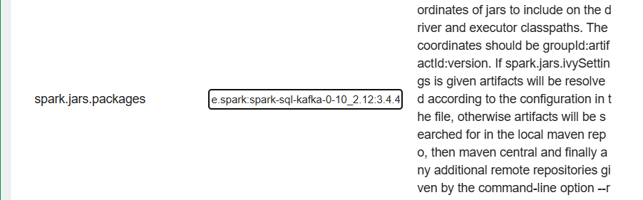

*4월 4주차*

```Data engineering/ ml```
> `MLlib.md`, `recommendation.md`, `kafka.md`, `airflow.md`, `2차 평가 준비 (notion에 정리중)

_#내맘대로TIL챌린지 #동아일보 #미디어프론티어 #글로벌소프트웨어캠퍼스 #GSC신촌_

_글로벌소프트웨어캠퍼스와 동아일보가 함께 진행하는 챌린지입니다._


---


# Regression
> zeppelin에서 ml 모듈을 사용하여 regression을 수행할 수 있다.

- `fish.csv` 파일을 이용해서 선형 회귀 (regression) 모델을 생성하고 예측한다.

```spark-shell
file_path = 'hdfs://localhost:9000/input/fish.csv'
# file_path = 'file:///home/ubuntu/damf2/data/fish.csv'
```
> csv 파일 위치 알려주는 코드는 위와 같이 `file_path`를 지정해서 알려줌. 

```spark-shell
%pyspark
from pyspark.ml.feature import StringIndexer
indexer = StringIndexer(inputCols=['Species'], outputCols=['species_idx'])
df = indexer.fit(df).transform(df)
```


---
## 협업 필터링 (collaborative filtering)

- 추천
- zeppelin `5.recommendation.md`
#### pyspark 내부의 `ALS`를 이용해서


--- 
## Classification
```python
file_path = 'hdfs://localhost:9000/input/fish.csv'
df = spark.read.csv(file_path, header=True, inferSchema=True)

# ============

from pyspark.sql.functions import col
df = df.filter(col('Species').isin('Bream', 'Smelt'))

# ============

from pyspark.sql.functions import when
from pyspark.sql.functions import col
df = df.withColumn(
    'species_idx',
    when(col('Species') == 'Bream', 1)
    .otherwise(0)
)

# ============

from pyspark.ml.feature import VectorAssembler

assembler = VectorAssembler(
    inputCols=[
        'Weight',
        'Length1',
        'Length2',
        'Length3',
        'Height',
        'Width'
    ],
    outputCol='features'
)
df = assembler.transform(df)

# ============

train_data, test_data = df.randomSplit([0.8, 0.2])

# ============

from pyspark.ml.classification import LogisticRegression

lr = LogisticRegression(featuresCol='features', labelCol='species_idx')
lr_model = lr.fit(train_data)

# ============

prediction = lr_model.transform(test_data)

# ============

from pyspark.ml.evaluation import BinaryClassificationEvaluator

evaluator = BinaryClassificationEvaluator(labelCol='species_idx', rawPredictionCol='rawPrediction', metricName='areaUnderROC')
result = evaluator.evaluate(prediction)
print(result)

# ============

from pyspark.ml.classification import RandomForestClassifier

rf = RandomForestClassifier(featuresCol='features', labelCol='species_idx', maxBins=500)
rf_model = rf.fit(train_data)

# ============

prediction = rf_model.transform(test_data)
prediction.show()

```

---
## Streaming
-zeppelin `6.streaming`


---

## Kafka
- zeppelin `7.kafka`

- kafka 설치
- kafka 실행
- kafka 테스트

> kafka는 메시지 큐라는 개념으로, kafka는 메시지를 저장하는 큐이다.


> 무인택배함과 비슷한 개념
>
> 누가 받는지 / 수신자는 관심 없음 - 보내는 입장 (publisher) 의 역할만 - 보내기만 / kafka가 저장 => subscriber 입장에서는 보내온 데이터가 있다면 읽을뿐
>
>
> 'topic': kafka가 들어오는 데이터를 계속 쌓는 중간다리의 역할
>

## kafka 다운로드 
~위치에서 
```shell
wget https://dlcdn.apache.org/kafka/3.9.0/kafka_2.13-3.9.0.tgz
```

- unzip
```shell
tar -zxvf kafka_2.13-3.9.0.tgz
```
- zookeeper 실행
```shell
bin/zookeeper-server-start.sh -daemon config/zookeeper.properties
```
- kafka 실행
```shell
bin/kafka-server-start.sh -daemon config/server.properties
```



> interpreter (zeppelin 설정을 바꿈) => kafka와 spark를 연결하기 위해서

---
# Airflow
## Airflow

> 자동화된 작업을 위한 오픈소스 관리자 프로그램

- Airflow는 DAG(Directed Acyclic Graph)을 이용해 작업을 관리한다.
- DAG는 작업의 순서를 정의

---
### Airflow의 구성요소

- `DAG` : 작업의 순서를 정의
- `Task` : 작업을 수행하는 단위
- `Operator` : 작업을 수행하는 클래스
- `Sensors` : 작업이 끝나는 것을 감지하는 클래스
- `Trigger` : DAG를 시작하는 클래스
- `Task Instance` : DAG에서 수행되는 작업
- `Log` : 작업의 실행 결과를 로그로 남김
- `Sla` : 작업이 끝나는 시간을 제한하는 클래스

---
### DAG

: 작업의 순서를 정의

: 시각적으로 보기 좋게 만들어주고

: 각각의 흐름을 보기 좋게 
- 특정 시간마다 workflow를 관리하는 process

`DAG` : 유향 `비순환` 그래프 -> 방향성은 있지만, 순환은 되지 않는 작업들
=> 시작이 있다면 끝이 있는 작업

---
- task
- graph


---
# 2차 평가 준비

물론입니다! 🚀

ㅡㅡ

## ORM vs SQL

| 기능 | ORM (Django ORM) | SQL |
| --- | --- | --- |
| 전체 조회 (SELECT) | `Model.objects.all()` | `SELECT * FROM 테이블명;` |
| 틀정 조건 조회 (WHERE) | `Model.objects.filter(컬럼='값')` | `SELECT * FROM 테이블명 WHERE 컬럼='값';` |
| 정렬 (ORDER BY) | `Model.objects.all().order_by('컬럼')` | `SELECT * FROM 테이블명 ORDER BY 컬럼 ASC;` |
| 내림차순 정렬 (ORDER BY DESC) | `Model.objects.all().order_by('-컬럼')` | `SELECT * FROM 테이블명 ORDER BY 컬럼 DESC;` |
| 틀정 컬럼만 조회 (SELECT 틀정 컬럼) | `Model.objects.values('컬럼1', '컬럼2')` | `SELECT 컬럼1, 컬럼2 FROM 테이블명;` |
| 중복 제거 (DISTINCT) | `Model.objects.values('컬럼').distinct()` | `SELECT DISTINCT 컬럼 FROM 테이블명;` |
| 데이터 삽입 (INSERT) | `Model.objects.create(컬럼='값', 컬럼2='값2')` | `INSERT INTO 테이블명 (컬럼, 컬럼2) VALUES ('값', '값2');` |
| 데이터 수정 (UPDATE) | `Model.objects.filter(조건).update(컬럼='새값')` | `UPDATE 테이블명 SET 컬럼='새값' WHERE 조건;` |
| 데이터 삭제 (DELETE) | `Model.objects.filter(조건).delete()` | `DELETE FROM 테이블명 WHERE 조건;` |
| AND 조건 조회 | `Model.objects.filter(컬럼1='값1', 컬럼2='값2')` | `SELECT * FROM 테이블명 WHERE 컬럼1='값1' AND 컬럼2='값2';` |
| OR 조건 조회 | `Model.objects.filter(Q(컬럼1='값1') | Q(컬럼2='값2'))` | `SELECT * FROM 테이블명 WHERE 컬럼1='값1' OR 컬럼2='값2';` |
| JOIN (내부 조인) | `ModelA.objects.select_related('ModelB')` | `SELECT * FROM A JOIN B ON A.키 = B.키;` |
| JOIN (다대대 조인) | `ModelA.objects.prefetch_related('ModelB')` | `SELECT * FROM A JOIN B ON A.id = B.a_id;` |
| 부모 검색 (LIKE) | `Model.objects.filter(컬럼__icontains='값')` | `SELECT * FROM 테이블명 WHERE 컬럼 LIKE '%값%';` |
| 범위 검색 (BETWEEN) | `Model.objects.filter(컬럼__range=(값1,값2))` | `SELECT * FROM 테이블명 WHERE 컬럼 BETWEEN 값1 AND 값2;` |
| NULL 값 조회 | `Model.objects.filter(컬럼__isnull=True)` | `SELECT * FROM 테이블명 WHERE 컬럼 IS NULL;` |
| IN 조회 | `Model.objects.filter(컬럼__in=[값1, 값2, 값3])` | `SELECT * FROM 테이블명 WHERE 컬럼 IN (값1, 값2, 값3);` |
| GROUP BY 지금 | `Model.objects.values('컬럼').annotate(Count('id'))` | `SELECT 컬럼, COUNT(id) FROM 테이블명 GROUP BY 컬럼;` |
| GROUP BY + HAVING | `Model.objects.values('컬럼').annotate(Count('id')).filter(Count('id')__gte=10)` | `SELECT 컬럼, COUNT(id) FROM 테이블명 GROUP BY 컬럼 HAVING COUNT(id) >= 10;` |


ㅡㅡ

**[1] ORM vs SQL 기본 문법 비교표**

(표 내용은 이전 작성과 동일)

---

**[2] 주요 시나리오별 ORM vs SQL 코드 비교**

(표 내용은 이전 작성과 동일)

---

# Insert - add new columns & values

### ORM
```python
Movie.objects.create(컬럼1='value1', 컬럼2='value2')
```

### SQL
```sql
INSERT INTO Movie(컬럼1, 컬럼2)
VALUES (value1, value2);
```

---

# SELECT : filtering, 골라내기

## 전체 출력

### ORM
```python
Movie.objects.all()
```

### SQL
```sql
SELECT * FROM Movie;
```

## year 순 정렬

### ORM
```python
Movie.objects.all().order_by('year')
```

## year 내림차순 정렬
```python
Movie.objects.all().order_by('-year')
```

### SQL
```sql
SELECT * FROM movies_movie
ORDER BY year DESC;
```

## 나이가 30살인 사람

### ORM
```python
User.objects.filter(age=30)
```

### SQL
```sql
SELECT * FROM movies_user
WHERE age=30;
```

## 20대만 조회

### ORM
```python
User.objects.filter(age__gte=20, age__lt=30)
User.objects.filter(age__range=[20,29])
```

### SQL
```sql
SELECT * FROM movies_user
WHERE age >= 20 AND age < 30;

SELECT * FROM movies_user
WHERE age BETWEEN 20 AND 29;
```

## 개봉년도가 2010년 이후 또는 2000년 이전

### ORM
```python
Movies.objects.filter(Q(year__lt=2000) | Q(year__gt=2010))
```

### SQL
```sql
SELECT * FROM movies_movie
WHERE year < 2000 OR year > 2010;
```

## 가장 최근작 골라내기

### ORM
```python
Movie.objects.aggregate(Max('year'))
```

### SQL
```sql
SELECT MAX(year) FROM movies_movie;
```

## User의 나이 평균

### ORM
```python
User.objects.aggregate(Avg('age'))
```

### SQL
```sql
SELECT AVG(age) FROM movies_user;
```

## 1번 영화의 최고 평점, 평균 평점

### ORM
```python
Score.objects.filter(movie_id=1).aggregate(Max('value'), Avg('value'))
```

### SQL
```sql
SELECT MAX(value), AVG(value) FROM movies_score WHERE movie_id=1;
```

## 1번 유저가 남긴 댓글 개수

### ORM
```python
Score.objects.filter(user_id=1).count()
```

### SQL
```sql
SELECT COUNT(value) FROM movies_score WHERE user_id=1;
```

## The로 시작하는 영화, 포함된 영화

### ORM
```python
Movie.objects.filter(title__startswith='The')
Movie.objects.filter(title__icontains='The')
```

### SQL
```sql
SELECT * FROM movies_movie WHERE title LIKE 'The%';
SELECT * FROM movies_movie WHERE title LIKE '%The%';
```

## "on."으로 끝나는 영화

### ORM
```python
Movie.objects.filter(title__endswith='on.')
```

### SQL
```sql
SELECT * FROM movies_movie WHERE title LIKE '%on.';
```

## "g__d" 패턴 매칭

### SQL
```sql
SELECT * FROM movies_movie WHERE title LIKE '%g__d%';
```

---

# UPDATE

## ORM
```python
movie = Movie.objects.get(id=1)
movie.title = '새로운 제목'
movie.save()
```

## SQL
```sql
SELECT * FROM movies_movie WHERE id=1;
UPDATE movies_movie SET title='Iron Man' WHERE id=1;
```

---

# DELETE

## ORM
```python
movie = Movie.objects.get(id=2)
movie.delete()
```

## SQL
```sql
DELETE FROM movies_movie WHERE id=2;
```

---

# JOIN

| 시나리오 | ORM | SQL |
|:---|:---|:---|
| 1번 유저가 작성한 점수 | `User.objects.get(id=1).score_set.all()` 또는 `Score.objects.filter(user_id=1)` | `SELECT * FROM movies_user JOIN movies_score ON movies_user.id = movies_score.user_id WHERE movies_user.id = 1;` |
| 1번 유저 이름과 점수 ID | `Score.objects.filter(user_id=1).values('user__name', 'id')` | `SELECT name, movies_score.id FROM movies_user JOIN movies_score ON movies_user.id = movies_score.user_id WHERE movies_user.id = 1;` |
| 100번 영화가 속한 카테고리 | `Movie.objects.get(id=100).categories.all()` | `SELECT * FROM movies_movie JOIN movies_category_movies ON movies_movie.id = movies_category_movies.movie_id JOIN movies_category ON movies_category_movies.category_id = movies_category.id WHERE movies_movie.id = 100;` |
| drama 카테고리에 속한 영화 | `Category.objects.get(name='drama').movies.all()` | `SELECT * FROM movies_movie JOIN movies_category_movies ON movies_movie.id = movies_category_movies.movie_id JOIN movies_category ON movies_category_movies.category_id = movies_category.id WHERE movies_category.name = 'drama';` |

---

# Book Data

 데이터 정제 (books_view, ratings_view, users_view 테이블을 보기 통기 data_type 등을 정렬)

```sql
CREATE VIEW books_view AS
SELECT
  ISBN,
  Book_Title,
  Book_Author,
  CAST(Year_Of_Publication AS INT) AS Year_Of_Publication,
  Publisher,
  Image_URL_S,
  Image_URL_M,
  Image_URL_L
FROM books;

CREATE VIEW ratings_view AS
SELECT
  CAST(User_ID AS INT) AS User_ID,
  ISBN,
  CAST(Book_Rating AS INT) AS Book_Rating
FROM ratings;

CREATE VIEW users_view AS
SELECT
  CAST(User_ID AS INT) AS User_ID,
  Location,
  CAST(Age AS INT) AS Age
FROM users;
```

# 데이터 확인

## 중복 데이터 확인

**Books 테이블에서 중복된 ISBN 확인**

```sql
SELECT isbn, COUNT(*) FROM books_view
GROUP BY isbn
HAVING COUNT(*) > 1;
```

- ISBN별 기록 수 계산
- ISBN이 2개 이상 다중 나오는 경우만 표시

> **COUNT(*)** : NULL없이 기록을 1회씩 계산
> **COUNT(테이블.컬럼명)** : NULL이 아니면 1회씩 계산

## 결쉬간 확인

**Users 테이블에서 Age의 결쉬간 확인**

```sql
SELECT COUNT(*)
FROM users_view
WHERE age IS NULL;
```

# 데이터의 기초 통계 확인

## 사용자 연령 통계

```sql
SELECT MAX(age), MIN(age), AVG(age) FROM users_view;
```

## 출판 연도 통계

```sql
SELECT MAX(year_of_publication), MIN(year_of_publication), AVG(year_of_publication) FROM books_view;
```

### 컬럼 확인 자리

| 상황 | 가장 권용 있는 메서드 |
|:---|:---|
| 컬럼 이름 + 타입만 보고 싶을 때 | DESCRIBE 테이블 |
| 컬럼 이름만 보고 싶을 때 | SHOW COLUMNS IN 테이블 |
| 시간 예능 + 컬럼 이름 + 데이터 형식 같이 | SELECT * FROM 테이블 LIMIT 1 |

## 평점의 분포 확인

```sql
SELECT book_rating, COUNT(*) FROM ratings_view
GROUP BY book_rating;
```

# 데이터의 주요 패턴 탐색

## 출판사별 책 수 및 평균 평점

```sql
SELECT
  books_view.publisher,
  COUNT(books_view.isbn),
  AVG(ratings_view.book_rating)
FROM
  books_view
JOIN
  ratings_view
ON
  books_view.isbn = ratings_view.isbn
GROUP BY
  books_view.publisher
ORDER BY
  COUNT(books_view.isbn) DESC;
```

- **필요 행정 순서**
    - books_view (cd 지정)
    - JOIN ratings_view
    - GROUP BY publisher
    - ORDER BY count

## 가장 많이 평가된 책과 평점

```sql
SELECT books_view.book_title, COUNT(books_view.isbn), AVG(ratings_view.book_rating)
FROM books_view
JOIN ratings_view
ON books_view.isbn = ratings_view.isbn
GROUP BY books_view.book_title
ORDER BY COUNT(books_view.isbn) DESC;
```

# 데이터 관계 분석

## 책 평점과 출판연도가 같이 관계

```sql
SELECT b.year_of_publication, AVG(r.book_rating)
FROM books_view b
JOIN ratings_view r
ON b.isbn = r.isbn
GROUP BY b.year_of_publication;
```

## 사용자 위치별 평점 차이

(평점 총 10개 이상인 경우만)

```sql
SELECT u.location, AVG(r.book_rating)
FROM users_view u
JOIN ratings_view r
ON u.user_id = r.user_id
GROUP BY u.location
HAVING COUNT(r.book_rating) >= 10;
```

### 시간 시간 확인하자

| 구문 | 함정 | 무엇이 와야할것인가? |
|:---|:---|:---|
| ON | 두 테이블의 공통점 같이 연결 | ex: a.id = b.user_id |
| WHERE | 거래 값에 대한 포인트 검색 | ex: age > 20 |
| GROUP BY | 그룹할 컬럼 지정 | ex: country |
| HAVING | 그룹 후 계산적 결과에 검색 | ex: COUNT(*) > 10 |

## 책 저자별 평균 평점

```sql
SELECT b.book_author, AVG(r.book_rating), COUNT(r.isbn)
FROM books_view b
JOIN ratings_view r
ON b.isbn = r.isbn
GROUP BY b.book_author
HAVING COUNT(r.book_rating) >= 10
ORDER BY AVG(r.book_rating) DESC;
```

- FROM → JOIN → ON → WHERE → GROUP BY → HAVING → SELECT → ORDER BY 순

# \<AIRLINE\>

## 요일별 출발 / 도착 지역 괄찰 평균

```sql
SELECT DayOfWeek, AVG(DepDelay), AVG(ArrDelay)
FROM airline
GROUP BY DayOfWeek;
```

## 항공사별, 월별 지역 및 운행 건수

```sql
SELECT UniqueCarrier, Month, COUNT(*), AVG(depDelay)
FROM airline
GROUP BY UniqueCarrier, Month;
```

## 전체 데이터에서 출발 지역 평균

```sql
SELECT
  (SUM(CASE WHEN DepDelay > 0 THEN 1 ELSE 0 END) * 100.0) / COUNT(*) AS delayed_percentage
FROM airline;
```

## 항공사별 취소\uc율

```sql
SELECT UniqueCarrier, (SUM(Cancelled) / COUNT(*) * 100) AS cancel_rate
FROM airline
GROUP BY UniqueCarrier;
```

## 가장 불비되는 공항

```sql
SELECT
    airport,
    SUM(cnt) AS total
FROM
(
    SELECT Origin AS airport, COUNT(*) AS cnt
    FROM airline
    GROUP BY Origin

    UNION ALL

    SELECT Dest AS airport, COUNT(*) AS cnt
    FROM airline
    GROUP BY Dest
) AS combined
GROUP BY airport
ORDER BY total DESC
LIMIT 10;
```

## 실제 비행시간 / 예상 비행시간 차이가 큰 비행 노선

```sql
SELECT *, ABS(real_time - crs_time) AS time_diff
FROM (
    SELECT Origin, Dest,
           AVG(ActualElapsedTime) AS real_time,
           AVG(CRSElapsedTime) AS crs_time
    FROM airline
    GROUP BY Origin, Dest
) t
ORDER BY time_diff DESC;
```

> **하지만 정적 SQL에서는 수행 중에 같은 계산자가 역법상 발생없기 하기 위해** 서브쿨리 (SELECT구문) 를 해석

---

# PYSPARK 

## 요일별 출발 / 도착 지역 평균 (PySpark)

```python
airline.groupBy('DayOfWeek').agg(
    avg('DepDelay').alias('avg_dep_delay'),
    avg('ArrDelay').alias('avg_arr_delay')
).show()
```

## 항공사별 월별 지역 및 운행 건수 (PySpark)

```python
airline.groupBy('UniqueCarrier', 'Month').agg(
    count('*').alias('flight_count'),
    avg('DepDelay').alias('avg_dep_delay')
).show()
```

## 출발지(PySpark)

```python
airline.groupBy('Origin').count().orderBy('count', ascending=False).show()
```

## 도착지 (PySpark)

```python
airline.groupBy('Dest').count().orderBy('count', ascending=False).show()
```

## 가장 붐비는 공항 (PySpark)

```python
origin = airline.groupBy('Origin').count()
dest = airline.groupBy('Dest').count()

combined = origin.unionByName(dest)

combined.groupBy('Origin').agg(
    sum('count').alias('total')
).orderBy('total', ascending=False).show()
```

## 실제시간 / 예상시간 차이가 큰 비행구간 (PySpark)

```python
from pyspark.sql.functions import abs, avg

airline.groupBy('Origin', 'Dest').agg(
    avg('ActualElapsedTime').alias('real_time'),
    avg('CRSElapsedTime').alias('crs_time')
).withColumn(
    'diff_time', abs(col('real_time') - col('crs_time'))
).orderBy('diff_time', ascending=False).show()
```

