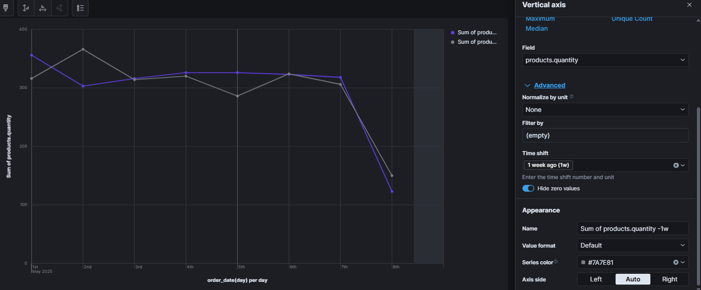

*5월 1주차*

- logstash
> `logstash.md`

_#내맘대로TIL챌린지 #동아일보 #미디어프론티어 #글로벌소프트웨어캠퍼스 #GSC신촌_

_글로벌소프트웨어캠퍼스와 동아일보가 함께 진행하는 챌린지입니다._


---
# `logstash.md`
# ELK stack

## logstash
- 설치 (8.18 version)
: `wget https://artifacts.elastic.co/downloads/logstash/logstash-8.18.0-linux-x86_64.tar.gz`

- unzip
: `tar -zxvf logstash-8.18.0-linux-x86_64.tar.gz` 

> logstash, elasticsearch, kibana 를 각 터미널에서 실행
```shell
bin/elasticsearch
```
```shell
bin/kibana
```

`localhost:5601 에서 동작 확인`

## git clone `insta` (django) 로 log 관리하기위해서 

- damf2 git repository에서 clone 해오기

`cd damf2` 위치에서
```shell
git clone https://github.com/DAMF2/insta.git
```

- 가상 환경 활성화후  `requirements.txt` 에 있는 패키지들 설치
```
ubuntu@smart:~/damf2/insta$ python -m venv venv
ubuntu@smart:~/damf2/insta$ source venv/bin/activate
```

- `pip install -r requirements.txt`
```shell
(venv) ubuntu@smart:~/damf2/insta$ pip install -r requirements.txt
```

```python 
pythonmanage.py migrate
```

```python
python manage.py runserver
``` 

- `localhost:8000` 접속 후 동작 확인
> insta 페이지 로그인, 게시물 생성 등의 log가 terminal에 찍히는것을 확인할 수 있다.

- log 설정
> `insta 폴더 안의 'settings.py` 파일에서 `LOGGING` 항목을 수정


LOGGING = {
    'version': 1, 
    'disable_existing_loggers': False,
    
    'handlers': {
        'file': {
            'level': 'INFO',
            'class': 'logging.FileHandler',
            'filename': 'django.log'},
        'console': {
            'class': 'logging.StreamHandler',
        },
    },
    
    'loggers': {
        'django.server': {
            'handlers': ['file', 'console'],
            'level': 'INFO',
            'propagate': False,
        }
    }
}

---
# `visualisation_kibana.md`
# Kibana로 시각화하기
> Kibana sample data(e-commerce)데이터로 시각화 연습


- `metric`으로 `Sum of taxful_total_price`를 시각화


- 일주일 전 products.quantity 의 sum을 시각화화


- 수식 (이번주 매출액 - 지난주 매출액)
.png)

- 음수는 빨강/ 양수는 파랑으로 색 설정


- map data visualisation


- mau (monthly active users) 시각화


- error code (response.keyword 가 500 이상인 서버 이상 에러 코드의 비율) 시각화


- error code 가 발생하는 url 시각화 


---
# `cohort_retention_analysis.md`

# 코호트 리텐션 분석
`https://www.kaggle.com/datasets/mkechinov/ecommerce-events-history-in-electronics-store/data` kaggle data로 cohort retention 분석
& Funnel 퍼널 분석

# 📊 코호트 리텐션 분석이란?

**코호트 리텐션 분석**은  
같은 시점에 유입된 사용자 집단(코호트)이  
얼마나 오래 서비스에 머무는지를  
시간 흐름에 따라 분석하는 방법입니다.

---

## ✅ 핵심 개념

- **코호트(Cohort)**:  
  공통된 특성을 가진 사용자 집단  
  (예: 가입일 기준, 첫 구매일 기준)

- **리텐션(Retention)**:  
  일정 기간 후에도 남아있는 비율  
  (예: 7일차 리텐션 = 7일 후 잔존율)

---

## ✅ 왜 중요한가?

- 신규 유입자의 **품질 평가**
- 마케팅/기능 업데이트의 **효과 검증**
- 사용자 이탈 시점 파악
- 서비스의 **지속 사용성**과 **고객 충성도 평가**

---

## ✅ 예시 표

| 코호트 (가입월) | 0일차 리텐션 | 7일차 리텐션 |
|----------------|--------------|--------------|
| 2025년 1월     | 100%         | 30%          |
| 2025년 2월     | 100%         | 40%          |

---

👉 **한마디 요약:**  
> 코호트별 사용자 유지 흐름을 분석해  
> 서비스의 지속 사용성(얼마나 오래 사용하는지)과  고객 충성도를 파악하는 방법

---
kaggle `eCommerce events history in electronics store` 데이터 => damf2 폴더 data 폴더 안으로 옮김

event type 이 `view, cart, other`인지 => Funnel analysis

- 데이터 전처리 먼저 
`/home/ubuntu/damf2/kibana/ecommerce.py`

## ✅ 타임스탬프 처리

UTC 타임존이 포함된 데이터를 **로컬 시간대**로 변환하고, **년-월-일 시:분:초** 형식만 남깁니다.

```python
# UTC 타임존 제거 (로컬 타임스탬프만 남기기)
df['event_time'] = df['event_time'].dt.tz_localize(None)

# 예: '2020-09-24 11:57:06 UTC' → '2020-09-24 11:57:06'
print(df.head())

---
✅ 월 단위 그룹핑
to_period() 함수를 사용해 월 단위로 데이터를 그룹화할 새로운 컬럼을 생성합니다.
```
# 이벤트가 발생한 '월' 정보 추출
```
df['event_month'] = df['event_time'].dt.to_period('M')
```

✅ 코호트 인덱스 만들기
사용자가 **처음 방문한 월(cohort month)**을 기준으로 코호트 분석용 인덱스를 생성합니다.

```
# 사용자별 첫 방문한 월(cohort month) 계산
df['cohort_month'] = df.groupby('user_id')['event_month'].transform('min')
```

✅ 날짜 분리 및 코호트 인덱스 계산
년도와 월을 각각 분리하고, 처음 방문한 시점(cohort month)과 이벤트 시점(event month) 간의 차이를 계산합니다.

```
# '년도'와 '월'을 분리 추출
invoice_year = df['event_month'].dt.year
invoice_month = df['event_month'].dt.month
cohort_year = df['cohort_month'].dt.year
cohort_month = df['cohort_month'].dt.month
```
# 코호트 인덱스: (몇 개월 차인지)
```
df['cohort_index'] = (invoice_year - cohort_year) * 12 + (invoice_month - cohort_month) + 1
```

✅ 데이터 형식 변환 및 저장
event_month와 cohort_month를 문자열로 변환한 후, 최종 데이터를 CSV로 저장합니다.
```
# 'Period' 객체 → 문자열로 변환 (예: '2020-09')
df['event_month'] = df['event_month'].astype('str')
df['cohort_month'] = df['cohort_month'].astype('str')
```
# 전처리된 데이터 저장
```
df.to_csv('/home/ubuntu/damf2/data/cohort_events.csv', index=False)
```

- visualisation

- view / cart / purchase 로 cohort analysis


- 코호트별 사용자 유지율


## ✅ 구성

- **X축 (cohort_index):**  
  → 사용자가 첫 방문 후 몇 개월 차인지 표시  
  (1 = 첫 달, 2 = 두 번째 달, ...)

- **Y축 (cohort_month):**  
  → 사용자가 처음 방문한 월 (코호트 그룹)

- **셀 값:**  
  → 각 코호트의 각 개월 차에서 **고유 사용자 수**를 집계  
  (Unique count of user_id)

- **색상:**  
  → 진할수록 사용자 수가 많음을 의미

---

## ✅ 이 히트맵이 보여주는 것

- 각 코호트가 **첫 방문 후 몇 개월까지 유지되었는지** 확인 가능
- 코호트별 **유지율 흐름**을 한눈에 파악
- 이탈 시점과 **충성도 높은 코호트** 식별 가능

---

👉 **요약:**  
> 코호트별로 사용자 이탈과 유지를 시각화해,  
> 첫 방문 후 몇 개월까지 사용자들이 남아 있었는지 분석하는 히트맵
> 빨간색: 신규 유저가 많이 들어왔다.
> 빨간색 유지가 적은 코호트는 이탈이 빠르다.
