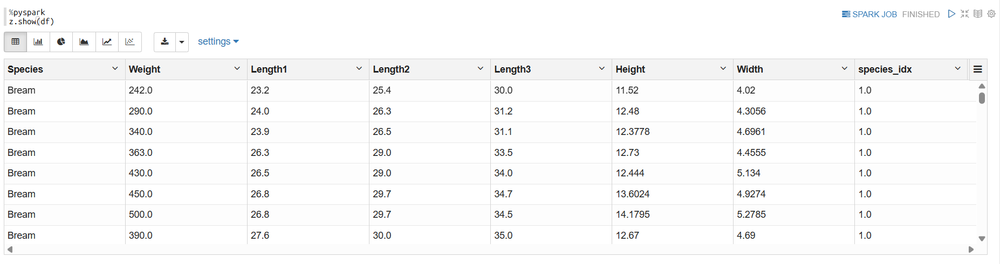

## Regression
> zeppelin에서 ml 모듈을 사용하여 regression을 수행할 수 있다.

- `fish.csv` 파일을 이용해서 선형 회귀 (regression) 모델을 생성하고 예측한다.

```spark-shell
file_path = 'hdfs://localhost:9000/input/fish.csv'
# file_path = 'file:///home/ubuntu/damf2/data/fish.csv'
```
> csv 파일 위치 알려주는 코드는 위와 같이 `file_path`를 지정해서 알려줌. 

```spark-shell
%pyspark
from pyspark.ml.feature import StringIndexer
indexer = StringIndexer(inputCols=['Species'], outputCols=['species_idx'])
df = indexer.fit(df).transform(df)
```
