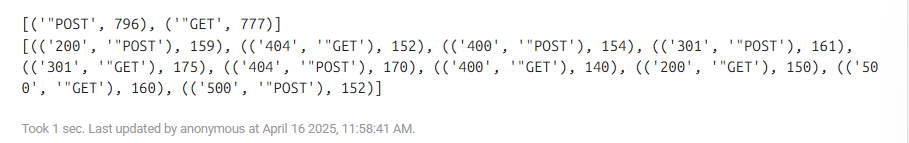

## 웹 크롤링

```ubuntu
damf2/automation/1.upbit-api/ 파일에서 작업중중
```

- API, 정적 사이트, 동적사이트

## API
- 업비트 API: 시세 현재가 조회


https://docs.upbit.com/kr

```
https://api.upbit.com/v1/ticker?markets=KRW-BTC
```


---
## Static web: 정적 사이트에서 크롤링
- `lotto.py`

https://dhlottery.co.kr/common.do?method=main


> 개발자 도구를 통해 내가 필요한 정보 (html코드)를 확인하기


---
## Dynamic web: 동적 사이트에서 크롤링