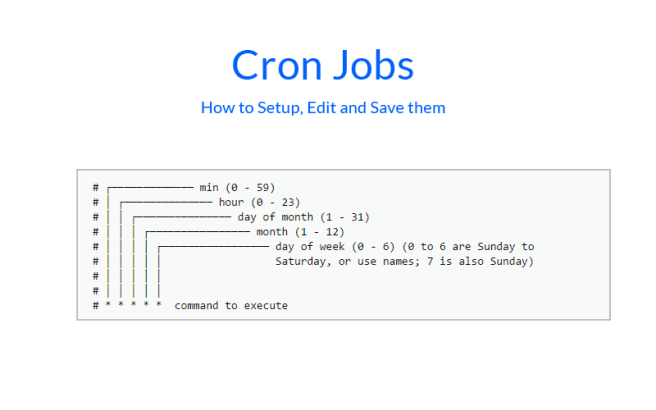

## CRON
```
A "cron job" is a scheduled task or command that runs automatically on a Unix-like operating system at a specific time or interval. These jobs are defined in a crontab file and executed by the cron daemon. 
```
> 크론 작업(Cron jobs)은 시스템이 사전 정의된 시간 또는 간격으로 실행하는 예약된(scheduled) 작업입니다. 일반적으로 크론 작업에는 시스템이 스크립트 파일에서 실행하는 일련의 단순 작업이 포함됩니다.


```
'*' : 분 (0-59)

'*' : 시 (0-23)

'*' : 일 (1-31)

'*' : 월 (1-12)

'*' : 요일 (0-6, 0은 일요일)
```

> 5분마다 반복하는 명령어 (예시. ubuntu 예제 중중)
>
`*/5 * * * * /home/ubuntu/damf2/automation/venv/bin/python /home/ubuntu/damf2/automation/0.log/0.log_generate.py`

---
### cron job 등록
```shell
crontab -e
```

### cron 리스트 확인
```shell
crontab -l
```

### cron 삭제
```shell
crontab -r
```
